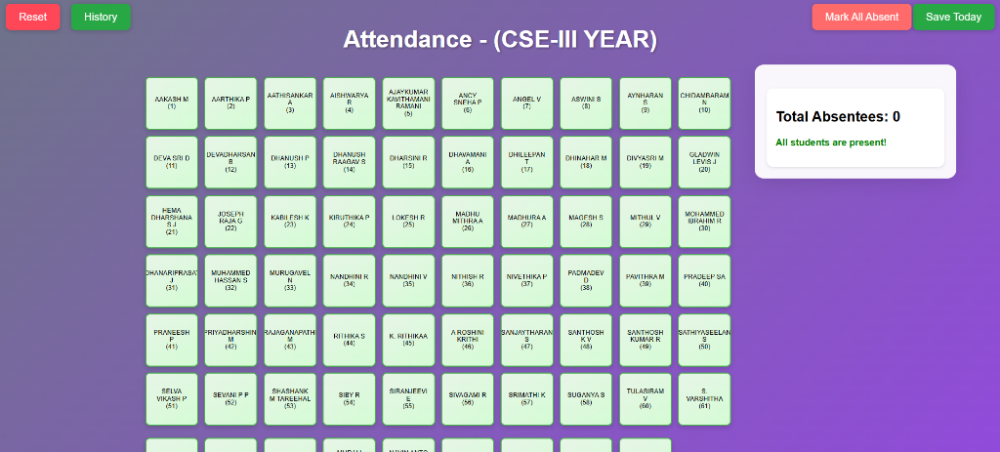

# Attendance System - CSE-III YEAR

A simple and intuitive web-based attendance tracking system for managing student attendance in a classroom setting.

## 🚀 Live Demo

Visit the application: [https://santhoshkv102003.github.io/Attendance/](https://santhoshkv102003.github.io/Attendance/)

## 📸 Screenshot



## ✨ Features

- **Visual Student Grid**: Easy-to-view grid layout displaying all students
- **Quick Attendance Marking**: Click on any student card to mark them absent/present
- **Real-time Counter**: Displays total number of absentees instantly
- **Bulk Actions**: 
  - Mark all students as absent with one click
  - Save attendance records for the current date
- **Attendance History**: View past attendance records
- **Reset Functionality**: Clear current attendance and start fresh
- **Student Status Indicator**: Visual feedback showing present (green) and absent (red/highlighted) students

## 🎯 How to Use

1. **Mark Individual Attendance**: Click on any student card to toggle their attendance status
2. **Mark All Absent**: Use the "Mark All Absent" button to quickly mark all students as absent
3. **Save Today's Attendance**: Click "Save Today" to store the current attendance record
4. **View History**: Click the "History" button to view previously saved attendance records
5. **Reset**: Use the "Reset" button to clear all current selections

## 💻 Technical Details

- **Frontend**: HTML, CSS, JavaScript
- **Hosting**: GitHub Pages
- **Storage**: Local browser storage for attendance records
- **Responsive Design**: Works on desktop and mobile devices

## 📊 Features Breakdown

### Current Status Display
- Shows total number of absentees in real-time
- Displays "All students are present!" when attendance is full

### Color Coding
- **Green Cards**: Students marked as present
- **Highlighted Cards**: Students marked as absent

### Data Persistence
- Attendance records are saved locally
- History feature allows reviewing past attendance

## 🔧 Installation & Setup

1. Clone the repository:
```bash
git clone https://github.com/santhoshkv102003/Attendance.git
```

2. Open `index.html` in your web browser

3. Start marking attendance!

## 📝 Future Enhancements

- Export attendance to CSV/Excel
- Authentication system for teachers
- Multiple class support
- Attendance statistics and reports
- Email/SMS notifications for absentees
- Dark mode toggle

## 🤝 Contributing

Contributions, issues, and feature requests are welcome! Feel free to check the issues page.

## 📄 License

This project is open source and available under the [MIT License](LICENSE).

## 👨‍💻 Developer

Developed by Santhosh KV

- GitHub: [@santhoshkv102003](https://github.com/santhoshkv102003)

## 📞 Support

For support, please open an issue in the GitHub repository or contact the developer.

